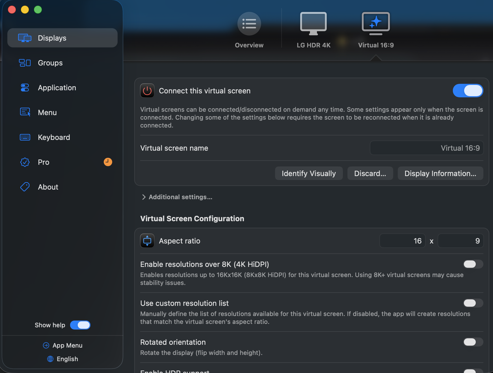
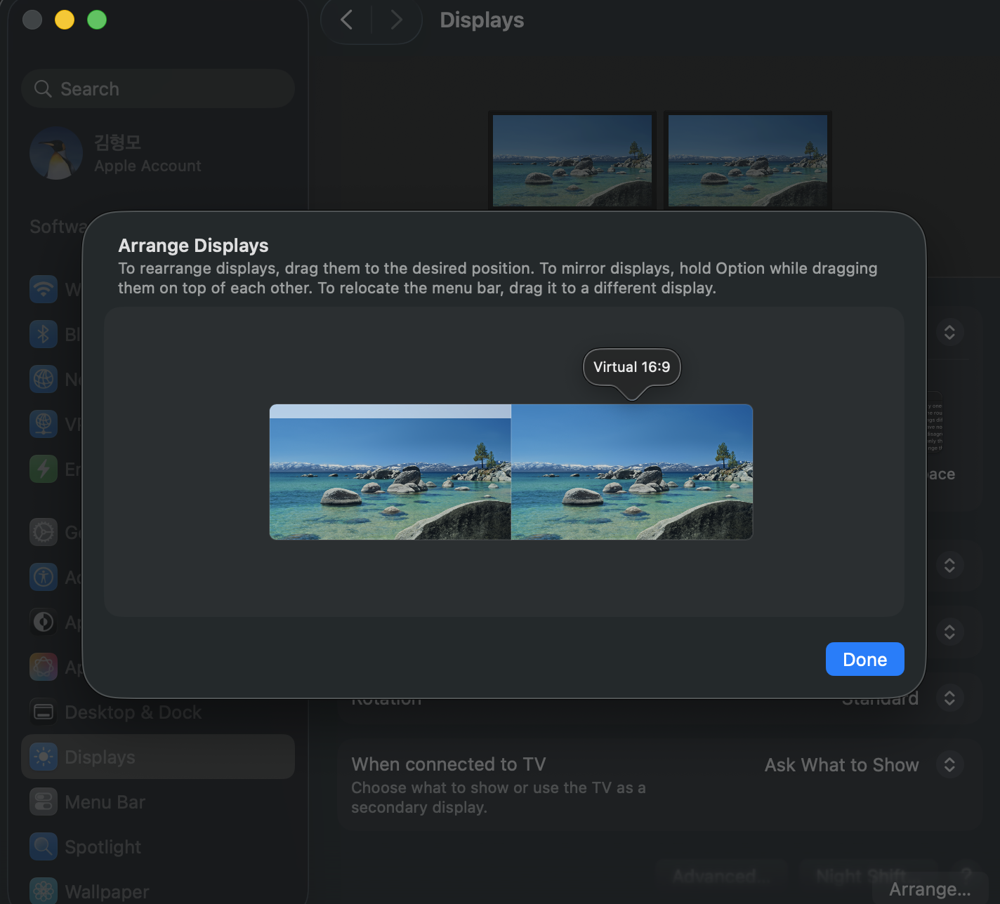

# mabinogi-mobile-automation

마비노기 모바일 창을 BetterDisplay 가상 모니터로 보내 화면 밖에서 계속 돌리다가,
플레이할 때만 메인 모니터로 불러옵니다. 두 방향 모두 명령 한 줄이면 됩니다.

게임은 켜 두고(자동 채집·대기 등) 메인 모니터는 비우고 싶을 때 씁니다. 창을 끄거나
최소화하지 않고 가상 모니터로 옮기기만 하므로 게임이 멈추지 않고 계속 돕니다.

## 배경

마비노기 모바일은 Mac 전용 앱이 없습니다. Apple Silicon Mac(여기서는 Mac Mini)에서는
App Store에서 iPad용 앱을 받아 실행합니다.

Mac에서 도는 iPad·iPhone 앱은 iPhone과 같은 실행 규칙을 따릅니다. 창이 포커스를 잃거나
최소화·숨김으로 가려지면 앱이 정지하고, 포커스 없는 백그라운드 실행은 지원하지 않습니다.
그래서 게임을 켜 둔 채 메인 모니터만 비우려면, 창을 숨기는 대신 화면 밖 가상 모니터로
옮겨 계속 보이는 상태로 두어야 합니다.

## 명령 한눈에 보기

| 명령 | 별칭 | 하는 일 |
| --- | --- | --- |
| `status` | `st` | 지금 창이 어느 모니터에 있는지 알려줍니다 |
| `screenshot` | `shot`, `ss` | 게임 창만 캡처해 미리보기로 엽니다 (이동·포커스 없음) |
| `foreground` | `fg` | 메인 모니터로 가져오고 포커스합니다 |
| `background` | `bg` | 가상 모니터로 보내 화면 밖에서 계속 실행합니다 |

```sh
scripts/mobinogi-window status       # 어느 모니터에 있나?
scripts/mobinogi-window screenshot   # 게임 창만 캡처
scripts/mobinogi-window foreground   # 메인 모니터로 (플레이)
scripts/mobinogi-window background   # 가상 모니터로 (주차)
```

모든 명령은 멱등해서, 이미 원하는 상태면 아무 일도 하지 않습니다. 그래서 `toggle`이
따로 없습니다. 상태를 뒤집으려면 `status`로 확인한 뒤 반대 명령을 실행하세요.

## 설치

처음 한 번만 설정하면 됩니다. 1~3단계는 필수, 4단계는 선택입니다.

### 1. BetterDisplay 설치와 가상 화면 만들기

[BetterDisplay](https://github.com/waydabber/BetterDisplay)를 설치합니다. 둘 중
편한 쪽을 쓰세요.

- Homebrew: `brew install --cask betterdisplay`
- 직접 내려받기: [릴리스 페이지](https://github.com/waydabber/BetterDisplay/releases)에서
  앱을 받아 `/Applications`에 넣습니다.

설치한 뒤 가상 화면을 하나 추가하고 아래처럼 설정합니다.



- **Connect this virtual screen**: 켜기. (언제든 껐다 켤 수 있습니다.)
- **Virtual screen name**: `Virtual 16:9`. (이름은 자유이며 식별용입니다.)
- **Aspect ratio**: `16 x 9`. 주차된 창이 게임 화면 비율을 유지합니다.
- *Enable resolutions over 8K*, *Use custom resolution list*, *Rotated
  orientation* 은 끄기. 기본값이면 충분하고, 8K 이상 가상 화면은 안정성 문제를
  일으킬 수 있습니다.

### 2. 보조 디스플레이로 배치

시스템 설정 → 디스플레이 → 정렬…(System Settings → Displays → Arrange…)에서
`Virtual 16:9`를 메인 디스플레이의 오른쪽에 놓습니다. 미러링하면 안 됩니다.
여기가 화면 밖 주차 공간입니다. 스크립트가 디스플레이 위치를 실시간으로 읽으므로
정확한 좌표는 필요 없고, 미러링되지 않은 별도의 보조 화면이기만 하면 됩니다.



### 3. 터미널에 '손쉬운 사용' 권한 부여

시스템 설정 → 개인정보 보호 및 보안 → 손쉬운 사용(System Settings → Privacy &
Security → Accessibility)에서 iTerm2를 켜세요(Terminal을 쓴다면 그쪽도). 다른 앱의
창을 옮기려면 이 권한이 필요합니다. 없으면 실행할 때 오류가 납니다(`assistive
access` 또는 오류 `-1719`).

> 창을 찾을 때 쓰는 식별자는 프로세스 이름 `ProductName`, 번들 ID
> `com.nexon.devcat.mm`입니다. 스크립트는 CoreGraphics로 디스플레이 배치를 실시간으로
> 읽으므로, 모니터를 다시 배치하거나 배율을 바꿔도 알아서 맞춥니다.

### 4. (선택) zsh 자동완성

명령 뒤에 하위 명령(`status`, `screenshot`, `foreground`, `background`와 별칭)이
탭으로 완성되게 하려면 설치 스크립트를 실행합니다.

```sh
scripts/install-completion
exec zsh          # 또는 새 터미널 열기
```

```sh
scripts/mobinogi-window <TAB>   # -> status  st  screenshot  shot  ss  foreground  fg  background  bg
```

설치 스크립트가 하는 일:

- `completions/_mobinogi-window`를 zsh가 자동완성 함수를 읽는 디렉터리
  `~/.local/share/zsh/site-functions/`에 심볼릭 링크로 겁니다. 저장소가 원본이고,
  다시 실행하면 링크만 새로 고칩니다.
- 캐시된 `compdump`를 지워, 다음 셸이 새 자동완성을 다시 읽게 합니다. `compinit`은
  캐시가 오래됐을 때만 새 자동완성을 인식하기 때문입니다. 예를 들어
  [prezto](https://github.com/sorin-ionescu/prezto)는 `~/.cache/prezto/`의 덤프를
  20시간 동안 재사용하고 그전에는 다시 읽지 않습니다. 설치 스크립트는 prezto와 기본
  zsh 캐시를 모두 지웁니다.

대상 디렉터리가 `$fpath`에 없다는 경고가 나오면, 스크립트가 알려 주는 줄을
`~/.zshrc`의 `compinit` 실행 전에 추가하고 다시 실행하세요.

## 하위 명령 편집 (개발자용)

`scripts/mobinogi-window` 하나가 원본입니다. 이 파일의 `SUBCOMMANDS` 표에서 명령
처리와 자동완성이 함께 나옵니다. `completions/_mobinogi-window`는 손으로 쓰는
파일이 아니라 이 표에서 생성됩니다. 표를 바꾸면 다시 생성하세요.

```sh
scripts/mobinogi-window __complete >| completions/_mobinogi-window
```

오래된 자동완성이 실수로 커밋되지 않도록, 클론마다 가드를 한 번 켜 둡니다.
([pre-commit](https://pre-commit.com)이 필요합니다: `brew install pre-commit`)

```sh
pre-commit install
```

`mabinogi-completion-sync` 훅이 자동완성을 다시 생성해 스테이징된 내용과 비교하고,
다르면 커밋을 막습니다. 훅 설정은 `.pre-commit-config.yaml`에 있고, 실제 검사는
`scripts/check-completion-sync`가 합니다.

Claude Code에서는 `.claude/CLAUDE.md`가 창 관련 요청("마비노기 어디 있어", "저리
치워", "다시 가져와", "마비노기 보여줘")을 이 스크립트로 연결하고, 상태를 먼저 확인한
뒤 이동을 제안하는 동작을 설명합니다. 에이전트용 신호와 전체 동작은 그 문서를
참고하세요.
